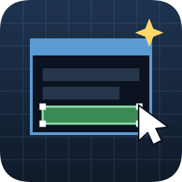

# Editor de Interfaces

Editor visual de pantallas para proyectos de **Pokemon Essentials**, como mod de
Maker Studio.

Colocas imagenes, textos, botones, barras de vida y Pokemon del equipo
arrastrandolos sobre un lienzo de 512x384, les pones animaciones de entrada, y
dices que hace cada boton. Se guarda en `UI/<nombre>.json`.

**Y esa es la idea de fondo: una pantalla deja de ser codigo y pasa a ser un
fichero de datos.** Cambiar un diseño no obliga a recompilar el juego ni a
reiniciarlo: guardas aqui y vuelves a abrir la pantalla.



---

## Hacen falta las dos mitades

Este mod es el **editor**. Lo que dibuja las pantallas dentro del juego es un
plugin de Ruby que vive en su propio repositorio:

> ### [Interfaces — el plugin de Essentials](https://github.com/yobrantoro/essentials-interfaces)
>
> **Instalalo antes de empezar.** Sin el, este editor guarda ficheros JSON que
> nada lee: podras diseñar, pero en el juego no aparecera nada.

| | Donde va |
|---|---|
| **El editor** (este mod) | Se instala desde el Marketplace de Maker Studio |
| **El motor** ([plugin](https://github.com/yobrantoro/essentials-interfaces)) | Se copia a la carpeta `Plugins/` de tu proyecto |

El editor comprueba al abrirse si el plugin esta en el proyecto, y avisa arriba si
falta. Probado en Essentials v21.1 sobre MKXP-Z.

---

## Que se puede poner en una pantalla

| Tipo | Para que |
|---|---|
| **Imagen** | Un PNG o un GIF. Los GIF animados se mueven solos: los reproduce MKXP-Z en C++, asi que no cuestan trabajo en Ruby |
| **Texto** | Con datos del juego entre llaves (ver abajo), contorno, y colocacion fina |
| **Boton** | Con imagen o como rectangulo de color. Cambia al pasar y al pulsar, y puede crecer |
| **Rectangulo** | Fondos y separadores, con borde opcional |
| **Ventana** | El marco de verdad del juego, no un rectangulo plano. Sin elegir marco usa **el que el jugador tenga puesto en Opciones**, asi que tus pantallas cambian con las suyas |
| **Animacion** | Una hoja de sprites que se reproduce sola |
| **Barra** | Se llena segun un dato. Cambia de color como las barras de vida |
| **Pokemon** | El icono o el sprite de un miembro del equipo |

### Estirar y girar, como en un editor de imagenes

Cualquier elemento se agarra por las esquinas y se estira, **imagenes incluidas**:

| Gesto | Que hace |
|---|---|
| Arrastrar una esquina | Estira **deformando** por donde tires |
| **Shift** + esquina | Estira **sin deformar** |
| Arrastrar la bolita de arriba | Gira |
| **Shift** + bolita | Gira de **15 en 15 grados** |
| Boton *Tamaño original* | Devuelve la imagen a su tamaño real |

El giro y el tamaño trabajan sobre el **centro**, y un boton girado se puede pulsar
donde se ve, no donde estaria sin girar.

### Listas que se repiten solas

Marcas un elemento como parte de un grupo y se dibuja N veces: en fila, en columna
o en rejilla, con la entrada escalonada para que aparezca en cascada. En los textos
y en las condiciones, `{n}` es el numero de copia — o sea que
`{equipo.{n}.nombre}` da el nombre del Pokemon 1, 2, 3...

Los seis del equipo, con su icono, su nombre y su barra de vida, **con una sola
definicion de cada cosa**.

### Barras con el grafico del juego

Una barra puede pintarse con arte en vez de con colores planos. La imagen es una
**tira con un estado por fila** (llena, media, baja), que es el formato que ya
trae `Graphics/UI/Party/overlay_hp` de Essentials: **el arte del propio juego vale
tal cual**. El lienzo la dibuja igual que el juego, tira incluida.

### Que hay elegido, como dato

La ficha del elemento marcado puede verse distinta sin nada raro: **que boton
esta elegido es un dato mas**, asi que se combina con las condiciones y con el
numero de copia de las listas repetidas. Es lo que hace que una pantalla de
equipo resalte el Pokemon sobre el que estas.

### Varios elementos a la vez

Con veinte botones, moverlos de uno en uno no es una opcion. **Ctrl o Shift +
clic** los añade al grupo (en el lienzo o en la lista de capas), y **arrastrando
por un hueco vacio** sale un rectangulo de goma que coge todo lo que toque.

Una vez marcados: se mueven juntos, las flechas los mueven todos, y aparece una
barra con **seis alineaciones** y **repartir en fila o columna**.

Se alinea contra el elemento **que tiene los tiradores**, no contra el borde del
grupo: eliges el que ya esta bien puesto y los demas van a el. Repartir deja el
**mismo hueco** entre unos y otros, no reparte los centros — con tamaños distintos
lo segundo deja huecos desiguales, que es justo lo que se ve mal.

Borrar y duplicar tambien trabajan sobre el grupo, en un solo paso de deshacer.

### Mostrar algo solo si se cumple una condicion

Se elige **de que va** la condicion y se rellena con desplegables:

| | |
|---|---|
| **Cuando este elegido un boton** | Lista de los botones que hay en la pantalla |
| **Un interruptor del juego** | Lista con **sus nombres**: `0045: Derrotado Gim 4` |
| **Una variable del juego** | Igual, con sus nombres |
| **Otro dato** | A mano, para lo que no cabe en los tres de arriba |

Los interruptores y variables se leen de `System.rxdata` y se enseñan igual que la
pestaña de condiciones de un evento de RPG Maker, que es donde ya se sabe leerlos.

En una lista repetida hay ademas la opcion **"el de esta misma copia"**: cada copia
mira su propio boton, que es lo que hace que la ficha elegida de un equipo se vea
distinta.

Un elemento escondido tampoco se puede pulsar, ni elegir con las flechas, ni
responder a su tecla rapida.

### Teclas de acceso rapido

Cada boton puede llevar una tecla que lo dispara **desde cualquier sitio de la
pantalla**, sin recorrer la lista con las flechas — lo que hace todo el mundo en un
menu de pausa. El editor avisa si dos botones comparten tecla o si eliges una que
ya usa el juego.

### Datos del juego en vivo

Un texto puede llevar datos entre llaves y se sustituyen al abrir la pantalla:

```
{jugador} tiene {dinero}$
{equipo.1.nombre}  Nv{equipo.1.nivel}
{equipo.1.hp} / {equipo.1.hp_max}
```

Hay 33: el jugador, su dinero, medallas, horas jugadas, Pokedex, donde esta, los
seis del equipo con nombre, nivel, vida, estado y estadisticas, las variables e
interruptores de los eventos, y el combate en marcha. En el editor salen en una
lista con su explicacion, y el lienzo enseña un valor de ejemplo para que puedas
cuadrar el hueco que van a ocupar de verdad.

Un dato que no se puede saber (sin partida empezada, equipo vacio, fuera de
combate) devuelve `---`. **Pedir un dato nunca tira el juego.**

---

## Como se abre una pantalla dentro del juego

Se configura en el propio editor, con casillas. Cuatro maneras:

1. **Menu de pausa** — marcas la casilla y eliges el puesto.
2. **Una tecla** — la eliges de una lista (las que ya usa el juego no salen).
3. **Un interruptor de interfaz** — un nombre tuyo, como `misiones`. Cualquier
   boton que lo active abre esa pantalla y cierra la de antes.
4. **Desde un evento** — `pbInterfaz("mi_pantalla")` en un comando de Script.

### Reemplazar una pantalla del juego

Las ocho pantallas de Essentials (mochila, equipo, pokedex, guardar, ficha, mapa,
pokegear y opciones) tienen su propio interruptor. La regla es una sola:

> **Manda la pantalla tuya si existe, y si no, la del juego.**

O sea: haces una pantalla, le pones el interruptor `mochila`, y esa pasa a ser la
mochila. La entrada del menu de pausa abre la tuya, y cualquier boton que use ese
interruptor tambien.

**Aviso honesto:** el *contenido* de esas pantallas (la lista de objetos, la lista
de Pokemon) lo genera el codigo del juego, no es un dato, y no se puede dibujar
aqui. Si reemplazas la mochila del todo tendras el marco pero no los objetos. Para
menus de botones va perfecto; para pantallas con contenido, lo util es dejar un
boton que abra la original. El editor te lo avisa al elegir reemplazar una.

---

## Manejo

Con **raton** y con **teclado** a la vez, sin configurar nada:

- Flechas para moverse entre botones, **Z** para pulsar, **X** para salir.
- El raton elige el boton por el que pasa, y al moverlo manda sobre la seleccion.
- Un elemento marcado como **cursor** se coloca solo junto al boton elegido.

---

## Atajos del editor

| | |
|---|---|
| Arrastrar | Mover un elemento |
| Arrastrar una esquina | Estirar (deformando) |
| Shift + esquina | Estirar sin deformar |
| Bolita de arriba | Girar (Shift: de 15 en 15 grados) |
| **Ctrl o Shift + clic** | **Añadir o quitar del grupo** |
| **Arrastrar en un hueco** | **Rectangulo de goma: coge todo lo que toque** |
| Flechas | Mover 1 pixel (todo el grupo) |
| Shift + flechas | Mover un paso de rejilla |
| Alt mientras arrastras | Sin imantar a la rejilla |
| Ctrl + rueda | Zoom |
| Ctrl+D | Duplicar |
| Supr | Borrar |
| Ctrl+S | Guardar |
| Ctrl+Z / Ctrl+Shift+Z | Deshacer / rehacer |

---

## Un detalle que importa

**El editor dibuja a 512x384 y estira picado, igual que el juego.** Se ve mas
basto que si dibujara a resolucion de pantalla, y es a proposito: si el editor
enseñara una calidad que el juego no puede dar, no serviria para cuadrar nada.

Por lo mismo, el texto se coloca midiendo la tinta real de la fuente en vez de
fiarse de las medidas de la caja de linea, y el editor carga la fuente del propio
proyecto (`Fonts/power green.ttf`). Lo que ves es lo que hay.

---

## Permisos que pide

| Permiso | Para que |
|---|---|
| `fs.project` | Leer los diseños de `UI/` y las imagenes de `Graphics/` |
| `fs.write.project` | Guardar los diseños |
| `ui.dialogs` | La ventana del editor |
| `ui.toasts` | Los avisos |

Ademas lee ficheros binarios (las imagenes) por `window.__TAURI__`, que es la via
que la propia API de mods documenta para esto: `ctx.fs.readProjectFile` devuelve
texto y un PNG es binario.

---

## Licencia

MIT. Ver [LICENSE](LICENSE).
